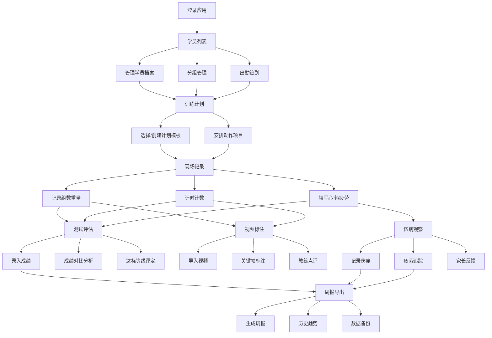

## 1. 产品概述

智慧体育训练桌面客户端——专为青少年体能教练在训练馆离线场景下记录和复盘学员表现而设计。解决教练纸质记录效率低、数据难以对比分析、复盘缺乏可视化支撑的痛点，目标用户为青少年体能训练馆的教练和管理人员。

## 2. 核心功能

### 2.1 用户角色

| 角色 | 使用方式 | 核心权限 |
|------|----------|----------|
| 教练 | 首次使用创建账号 | 学员管理、训练计划、现场记录、测试评估、视频标注、伤病观察、周报导出全部功能 |
| 管理员 | 由系统创建 | 除教练权限外，可管理教练账号和数据备份 |

### 2.2 功能模块

1. **学员列表窗口**：学员档案管理、分组管理、出勤签到、学员搜索筛选
2. **训练计划窗口**：计划模板库、自定义计划、动作项目安排、周期规划
3. **现场记录窗口**：组数重量记录、计时计数器、心率手填、疲劳评分、教练即时备注
4. **测试评估窗口**：测试成绩录入、成绩对比分析、达标等级评定、历史趋势图
5. **视频标注窗口**：短视频导入、关键帧标注、教练点评文字/语音
6. **伤病观察窗口**：伤痛部位记录、疲劳评分追踪、伤病备注、家长反馈录入
7. **周报导出窗口**：周报自动生成、历史趋势图表、数据备份与恢复

### 2.3 页面详情

| 页面名称 | 模块名称 | 功能描述 |
|----------|----------|----------|
| 学员列表 | 学员档案卡片 | 显示学员姓名、年龄、分组、头像、近期出勤状态，支持增删改 |
| 学员列表 | 分组管理 | 创建/编辑/删除分组（如"U12基础组""U15竞技组"），拖拽学员调整分组 |
| 学员列表 | 出勤签到 | 按日期签到，支持批量签到、请假标记、缺勤统计 |
| 训练计划 | 计划模板库 | 预置通用模板（如"力量基础""速度灵敏""柔韧恢复"），可复制修改 |
| 训练计划 | 自定义计划 | 从空白创建计划，设置周期、目标、动作项目列表 |
| 训练计划 | 动作项目安排 | 添加动作（深蹲/卧推/冲刺等），设置组数、次数、重量、间歇时间 |
| 现场记录 | 组数重量记录 | 实际完成组数、重量录入，与计划对比显示完成度 |
| 现场记录 | 计时计数器 | 内置秒表和计数器，支持间歇倒计时 |
| 现场记录 | 心率手填 | 手动输入运动后/安静心率，标红异常值 |
| 现场记录 | 疲劳评分 | RPE量表（1-10），教练主观疲劳评价 |
| 测试评估 | 成绩录入 | 录入体测项目成绩（50m/立定跳远/引体向上/耐力跑等） |
| 测试评估 | 成绩对比 | 同一学员多次测试成绩折线对比、同组学员成绩横向对比 |
| 测试评估 | 达标等级 | 根据国家标准或自定义标准评定优秀/良好/及格/不及格 |
| 视频标注 | 短视频导入 | 导入本地MP4/MOV短视频，按学员和日期归档 |
| 视频标注 | 关键帧标注 | 在视频时间轴上标记关键帧，添加文字描述 |
| 视频标注 | 教练点评 | 对视频或关键帧添加文字点评，支持时间戳关联 |
| 伤病观察 | 伤痛记录 | 记录伤痛部位（人体图选择）、程度、发生日期、恢复状态 |
| 伤病观察 | 疲劳追踪 | RPE趋势图、连续疲劳预警 |
| 伤病观察 | 家长反馈 | 录入家长反馈信息（居家状态/睡眠/饮食等），关联学员 |
| 周报导出 | 周报生成 | 自动汇总当周出勤、训练完成度、测试成绩、伤病情况，生成周报 |
| 周报导出 | 历史趋势 | 学员多维度数据趋势折线图（体能/出勤/疲劳等） |
| 周报导出 | 数据备份 | 本地数据导出为JSON/Excel，支持数据恢复导入 |

## 3. 核心流程

教练打开应用后，首先在学员列表中管理学员和分组，课前进行出勤签到；然后切换到训练计划窗口选择或创建当日计划；训练过程中在现场记录窗口实时记录组数重量、计时计数和心率；训练结束后进行测试评估或视频标注复盘；发现伤病情况及时记录到伤病观察窗口；每周通过周报导出窗口生成周报并备份数据。

## 4. 用户界面设计

### 4.1 设计风格

- **主色调**：活力橙 (#FF6B35) + 深海蓝 (#1A365D)，传达运动活力与专业信赖
- **辅助色**：浅灰 (#F7F8FA) 背景 + 白色卡片 + 暗灰 (#2D3748) 文字
- **警示色**：红色 (#E53E3E) 异常心率/伤痛、黄色 (#ECC94B) 疲劳预警、绿色 (#38A169) 达标通过
- **按钮风格**：圆角8px，主按钮实色填充，次按钮描边，悬停微阴影
- **字体**：标题用 "Noto Sans SC" 粗体，正文用 "Noto Sans SC" 常规，数字用等宽字体
- **布局风格**：左侧固定导航栏 + 右侧内容区，卡片式模块布局
- **图标风格**：线性图标（Lucide），统一2px描边

### 4.2 页面设计概览

| 页面名称 | 模块名称 | UI元素 |
|----------|----------|--------|
| 学员列表 | 学员档案卡片 | 网格布局卡片，每张含头像/姓名/年龄/分组标签/出勤率进度条，右上角操作菜单 |
| 学员列表 | 分组管理 | 左侧分组树+右侧学员列表，拖拽手柄，分组标签彩色 |
| 学员列表 | 出勤签到 | 日历式签到面板，绿色已到/灰色缺勤/黄色请假，底部统计栏 |
| 训练计划 | 计划模板库 | 卡片网格展示模板，缩略预览+名称+标签，点击展开详情 |
| 训练计划 | 动作项目安排 | 列表式排列，每行含动作名/组数/次数/重量/间歇，可拖拽排序 |
| 现场记录 | 组数重量记录 | 表格式录入，行=组数，列=重量/次数/完成状态，进度条显示完成度 |
| 现场记录 | 计时计数器 | 大号数字显示，开始/暂停/重置按钮，间歇倒计时环形进度 |
| 测试评估 | 成绩对比 | 折线图+柱状图，图例切换，悬浮详情提示框 |
| 测试评估 | 达标等级 | 等级标签（优秀金色/良好蓝色/及格绿色/不及格红色） |
| 视频标注 | 视频播放器 | 居中播放器，底部时间轴+标注标记点，右侧标注列表面板 |
| 伤病观察 | 人体图 | 前后两面人体轮廓，点击部位标记伤痛，颜色表示程度 |
| 周报导出 | 周报预览 | A4纸样式预览，图表+文字混排，导出按钮 |

### 4.3 响应式设计

- 桌面优先设计，最小支持1280px宽度
- 导航栏可折叠为图标模式（宽度<1024px时）
- 内容区卡片自适应列数

### 4.4 3D场景

不适用
