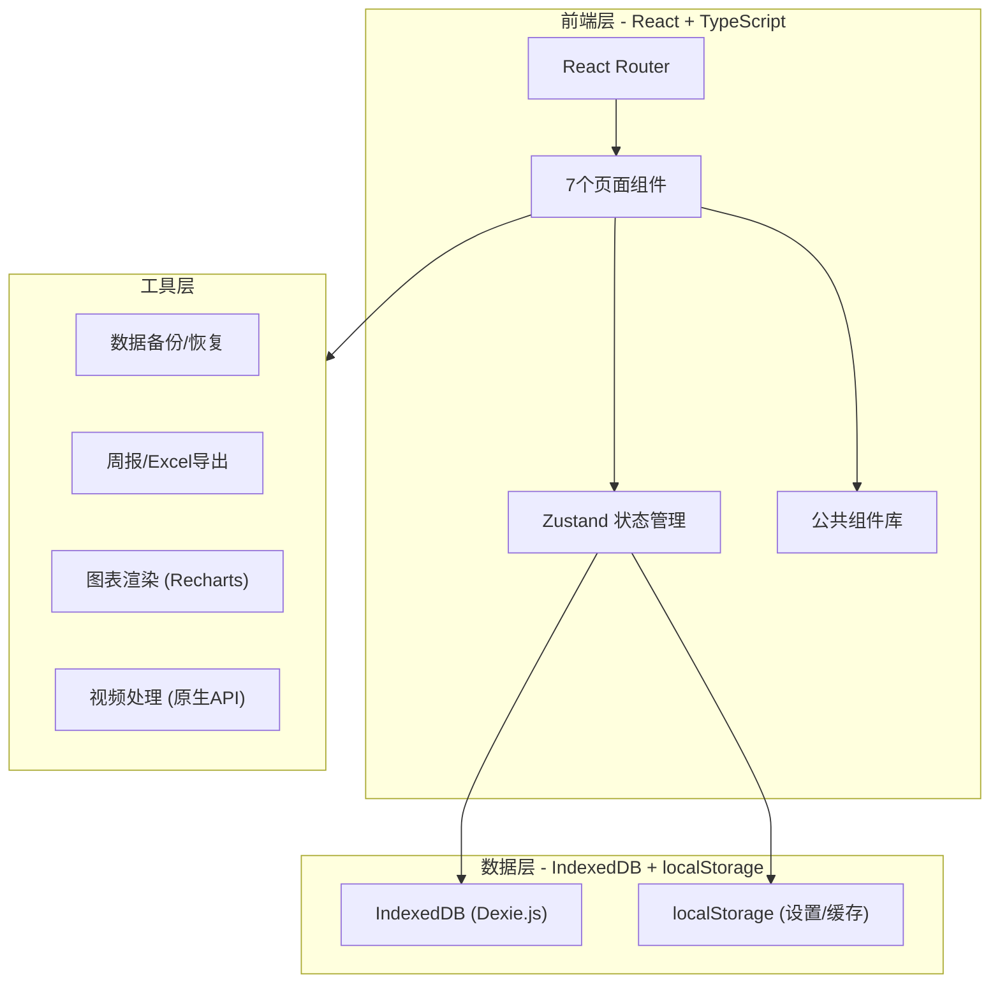
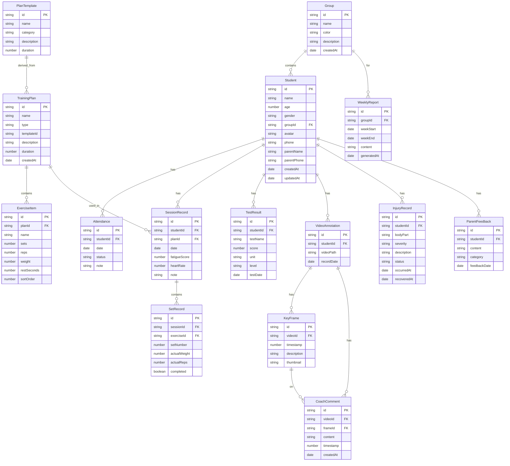

## 1. 架构设计



## 2. 技术说明

- **前端**：React@18 + TypeScript + TailwindCSS@3 + Vite
- **初始化工具**：vite-init (react-ts 模板)
- **后端**：无（纯前端离线应用）
- **数据库**：IndexedDB（通过 Dexie.js ORM），localStorage 用于设置和缓存
- **图表**：Recharts（成绩对比、历史趋势）
- **视频**：原生 HTML5 Video API + Canvas（关键帧截取）
- **导出**：xlsx-js-style（Excel导出）、html2canvas + jsPDF（周报PDF导出）
- **状态管理**：Zustand
- **路由**：React Router DOM v6
- **图标**：lucide-react
- **日期处理**：dayjs
- **拖拽排序**：@dnd-kit/core + @dnd-kit/sortable

## 3. 路由定义

| 路由 | 用途 |
|------|------|
| / | 重定向到 /students |
| /students | 学员列表窗口 |
| /plans | 训练计划窗口 |
| /records | 现场记录窗口 |
| /assessments | 测试评估窗口 |
| /video-tags | 视频标注窗口 |
| /injuries | 伤病观察窗口 |
| /reports | 周报导出窗口 |

## 4. API定义

无后端API，所有数据通过 IndexedDB 本地存储。数据操作通过 Zustand Store + Dexie.js 封装的 Repository 层实现。

## 5. 服务器架构图

不适用（纯前端离线应用）

## 6. 数据模型

### 6.1 数据模型定义



### 6.2 数据定义语言

使用 Dexie.js 定义 IndexedDB schema：

```typescript
// Dexie 数据库版本定义
const db = new Dexie('SmartTrainingDB')
db.version(1).stores({
  students: '++id, name, groupId, createdAt',
  groups: '++id, name',
  attendance: '++id, studentId, date, status',
  trainingPlans: '++id, name, type, templateId, createdAt',
  exerciseItems: '++id, planId, sortOrder',
  planTemplates: '++id, name, category',
  sessionRecords: '++id, studentId, planId, date',
  setRecords: '++id, sessionId, exerciseId',
  testResults: '++id, studentId, testName, testDate',
  videoAnnotations: '++id, studentId, recordDate',
  keyFrames: '++id, videoId, timestamp',
  coachComments: '++id, videoId, frameId, createdAt',
  injuryRecords: '++id, studentId, bodyPart, occurredAt',
  parentFeedback: '++id, studentId, feedbackDate',
  weeklyReports: '++id, groupId, weekStart'
})
```
